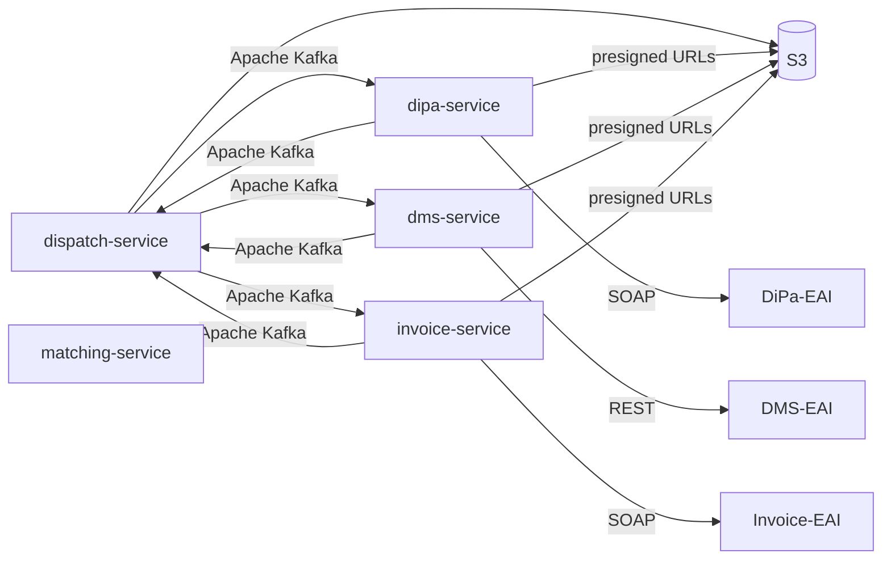
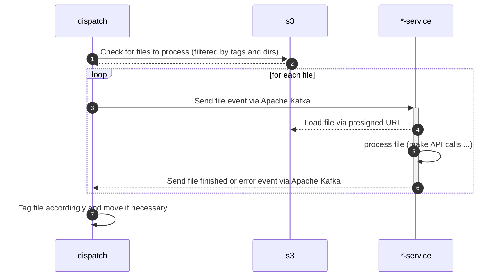
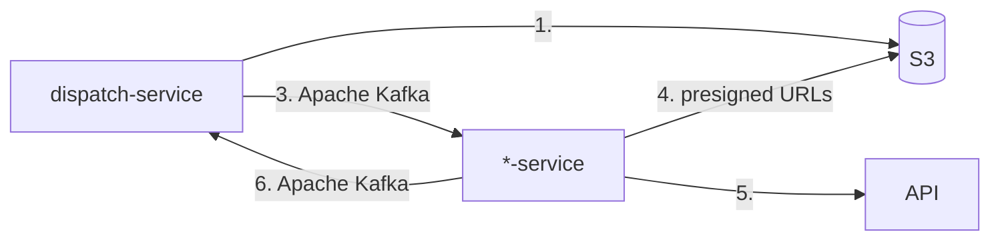

# SWIM

[![Made with love by it@M][made-with-love-shield]][itm-opensource]
<!-- feel free to add more shields, style 'for-the-badge' -> see https://shields.io/badges -->

Repository for different services and components of the SWIM project.
SWIM comes from german "Stadtweites Inputmanagement" which stands for "city-wide input management".

The different components are built with [Spring](https://spring.io/).

## Components

Following a list and short description of the different components:

- [matching-service](./matching-service): Service for managing recipient matching data for the SWIM
- [dispatch-service](./dispatch-service): Service for notifying other services (i.e. DMS) that a file is ready for further processing via Kafka.
- [handler-core](./handler-core): Library with base components for building a new service for handling notifications from the `dispatch-service`.
- [dms-service](./dms-service): Service for transferring files into DMS when notified by the `dispatch-service` via Kafka. Based on `handler-core`.
- [dipa-service](./dipa-service): Service for transferring files into DiPa when notified by the `dispatch-service` via Kafka. Based on `handler-core`.
- [scripts](./scripts): Helper scripts for maintenance tasks.

## Architecture

### Default flow

## Contributing

Contributions are what make the open source community such an amazing place to learn, inspire, and create. Any contributions you make are **greatly appreciated**.

If you have a suggestion that would make this better, please open an issue with the tag "enhancement", fork the repo and create a pull request. You can also simply open an issue with the tag "enhancement".
Don't forget to give the project a star! Thanks again!

1. Open an issue with the tag "enhancement"
2. Fork the Project
3. Create your Feature Branch (`git checkout -b feature/AmazingFeature`)
4. Commit your Changes (`git commit -m 'Add some AmazingFeature'`)
5. Push to the Branch (`git push origin feature/AmazingFeature`)
6. Open a Pull Request

More about this in the [CODE_OF_CONDUCT](/CODE_OF_CONDUCT.md) file.

## License

Distributed under the MIT License. See [LICENSE](LICENSE) file for more information.

## Contact

it@M - opensource@muenchen.de

<!-- project shields / links -->
[made-with-love-shield]: https://img.shields.io/badge/made%20with%20%E2%9D%A4%20by-it%40M-yellow?style=for-the-badge
[itm-opensource]: https://opensource.muenchen.de/
