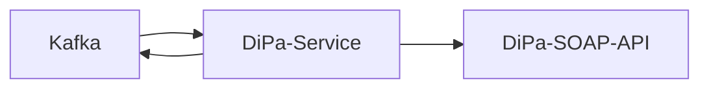

# SWIM DiPa-Service

SWIM service for transferring files into the "DiPa" (short for German "digitale Personalakte", digital personnel file) when notified by [dispatch-service](../dispatch-service) via Apache Kafka.
Based on [handler-core](../handler-core).

## Architecture



### Error handling

Errors which occur during processing a file are transmitted via Kafka to the [dispatch-service](../dispatch-service) which handles them accordingly.

## Development

- The dipa-service is built with JDK21
- For local development and testing the dev docker-compose stack of the [dispatch-service](../dispatch-service) can be used.
    - Can be started with `docker compose up -d`
- The Spring profile `local` is preconfigured for using the stack
    - Activate it either manually or by using the provided run configuration
    - Additionally, the dipa credentials need to be configured in the [`application-local.yml`](./src/main/resources/application-local.yml). See [Configuration](#configuration) for reference.
- After starting the application, file processing can be triggered via Kafka in one of the following ways:
    - via [dispatch-service](../dispatch-service)
    - via [Kafka-UI](http://localhost:8089/)

## Configuration

```yaml
swim:
  # dipa connection configuration
  dipa:
    endpoint-url:
    username:
    password:
  # use cases
  use-cases:
    - name: # required
      type: # required, see section "Type"
      target-source:
        type: # required, see section "Target source"
        static-pers-nr: # for target-source static
        static-category: # for target-source static
        filename-pers-nr-pattern: # for target-source filename
        filename-category-pattern: # for target-source filename
      incoming:
        incoming-subject-pattern: # define Incoming subject via Regex pattern, default: null
      content_object:
        filename-overwrite-pattern: # overwrite ContentObject name via Regex pattern, default: filename
      context:
        username: # user under which the DiPa action is executed
```

### Pattern

The `*-pattern`-fields require a specific syntax (inspired by the sed command and regex substitution).

See [Pattern](../handler-core/README.md#pattern).

### Type

The `type` attribute of a use case defines what type of resource is created in the DiPa.

- `hr_subfile_incoming`: Creates an Incoming inside a given HrSubfile.

### Target source

The `target-source.type` attribute of a use case defines how the target resource, under which the new resource is created, is resolved.

- `static`: The target PersNr and Category are defined statically via the `static-*` use case attributes.
- `filename`: The target PersNr and Category are resolved via the Regex patterns under `filename-*-pattern`.
