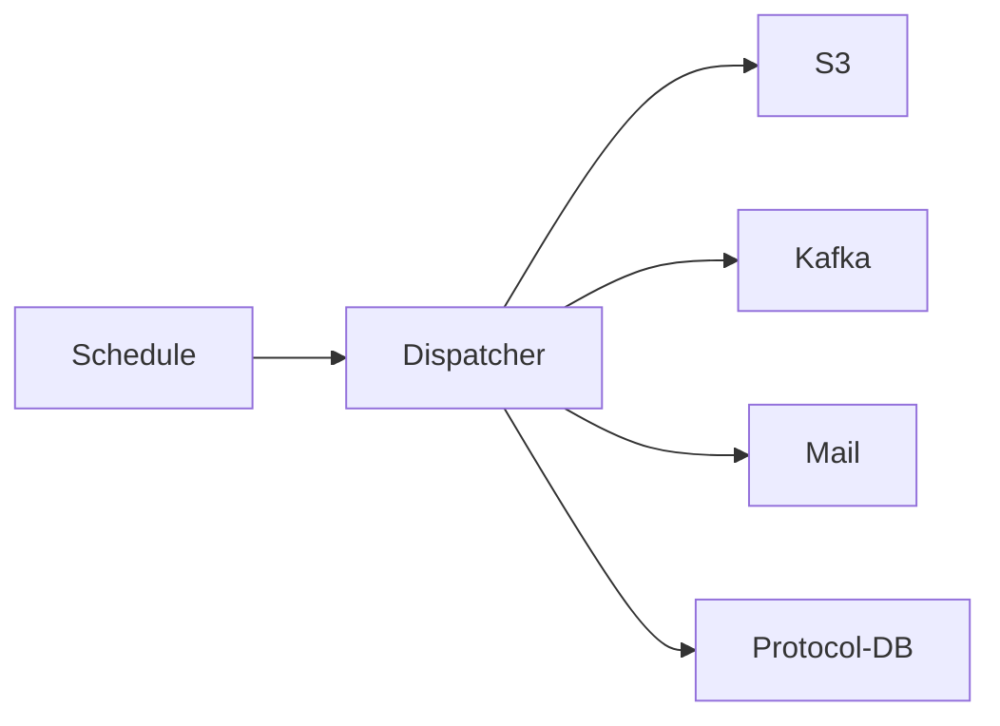

# SWIM Dispatcher-Service

SWIM service for notifying other services (i.e. DMS) that a file is ready for further processing via Kafka.

## Architecture



## Development

- The swim-dispatch-service is built with JDK21
- For local development and testing a dev docker-compose stack is provided in `./stack`
    - Can be started with `docker compose up -d`
- The Spring profile `local` is preconfigured for using the stack
    - Activate it either manually or by using the provided run configuration
- After starting the following UIs are available:
  - [S3/Minio](http://localhost:9001/) (User: `minio`, PW: `Test1234`)
  - [Mailpit](http://localhost:8025/)
  - [Kafka-UI](http://localhost:8089/)
  - [pgAdmin](http://localhost:5050/)

## Adding additional target

For adding additional destinations the according outgoing Kafka binding needs to be added as following:

```yaml

spring:
  cloud:
    stream:
      bindings:
        example-out:
          destination: swim-example-local
```

The binding key (in the above example `example-out`) can then be used as use case destination.

See [`application-local.yml`](./src/main/resources/application-local.yml) as example.
