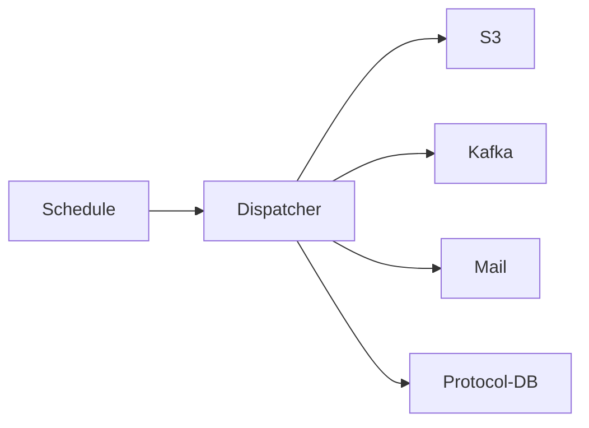

# SWIM Dispatcher-Service

SWIM service for notifying other services (i.e. DMS) that a file is ready for further processing via Kafka.

## Architecture



## Development

- The swim-dispatch-service is built with JDK21
- For local development and testing a dev docker-compose stack is provided in `./stack`
    - Can be started with `docker compose up -d`
- The Spring profile `local` is preconfigured for using the stack
    - Activate it either manually or by using the provided run configuration
- After starting the following UIs are available:
  - [S3/Minio](http://localhost:9001/) (User: `minio`, PW: `Test1234`)
  - [Mailpit](http://localhost:8025/)
  - [Kafka-UI](http://localhost:8089/)
  - [pgAdmin](http://localhost:5050/)

## Configuration

In addition to the properties listed below, other Spring libraries must also be configured (e.g. Mail, DB).
These properties and example values can be found in the [`application-local.yml`](./src/main/resources/application-local.yml).

```yaml
swim:
  dispatching-cron: # cron interval for triggering dispatching
  protocol-processing-cron: # cron interval for triggering protocol processing
  fallback-mail: # fallback mail used for notification mails if use case can't be resolved
  mail:
    from-address: # mail address used for sending notifications
    mail-subject-prefix: # prefix added to mail subject (e.g. for specifying the environment)
    locale: # change the language of the mails (optional, default: en, alternatives: de)
  # s3 connection options
  s3:
    url:
    access-key:
    secret-key:
  # list of use cases
  use-cases:
    - name: # name of the use case
      bucket: # bucket to look for new files in
      path: # path to look for new files under
      recursive: # if the file lookup should be recursive (optional, default: false)
      max-file-size: # max size files can have that they are dispatched (optional, default: 100 MiB)
      required-tags: # map of tags required on files to be dispatched (optional, default: {})
      requires-metadata: # if a metadata file is required (optional, default: false)
      destination-binding: # the target destination binding, see section "Adding additional target"
      overwrite-destination-via-metadata: # if the destination binding should be resolved via the metadata file (optional, default: false, fallback to destination-binding)
      mail-addresses: # list of mail addresses used for sending notifications
      sensitive-filename: # if the filename is sensitive, if true it isn't logged (optional, default: false)
```

### Adding additional target

For adding additional destinations the according outgoing Kafka binding needs to be added as following:

```yaml

spring:
  cloud:
    stream:
      bindings:
        example-out:
          destination: swim-example-local
```

The binding key (in the above example `example-out`) can then be used as use case destination.
