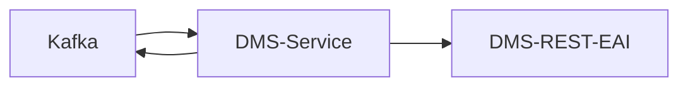

# SWIM DMS-Service

SWIM service for transferring files into the "eAkte" (internal German name for a record and document management system, in this repository further referred to as DMS) when notified by [dispatch-service](../dispatch-service) via Apache Kafka.
Based on [handler-core](../handler-core).

## Architecture



For the DMS-REST-EAI the [`refarch-dms-integration-fabasoft-rest-api` module](https://github.com/it-at-m/refarch/tree/main/refarch-integrations/refarch-dms-integration/refarch-dms-integration-fabasoft-rest-api) is used. 

### Error handling

Errors which occur during processing a file are transmitted via Kafka to the [dispatch-service](../dispatch-service) which handles them accordingly.

### DMS

Further documentation regarding the DMS can be found here (internal only):
- https://confluence.muenchen.de/display/KM53/REST-EAI-Schnittstelle
- https://dmsresteai-dev-dmsresteai.apps.capk.muenchen.de/swagger-ui/index.html

The different DMS resources (used in this service) follow following hierarchy (in syntax "english (german)"):

Fileplan (Aktenplan) → (multiple) Apentry (Aktenplaneintrag) → SubjectArea (Aktenplaneintrag (Betreffseinheit)) → File (Sachakte) → Procedure (Vorgang) → Incoming (Eingang) → ContentObject (Schriftstück)

## Development

- The dms-service is built with JDK21
- For local development and testing the dev docker-compose stack of the [dispatch-service](../dispatch-service) can be used.
    - Can be started with `docker compose up -d`
- The Spring profile `local` is preconfigured for using the stack
    - Activate it either manually or by using the provided run configuration
    - Additionally, the dms credentials need to be configured in the [`application-local.yml`](./src/main/resources/application-local.yml). See [Configuration](#configuration) for reference.
- After starting the application, file processing can be triggered via Kafka in one of the following ways:
    - via [dispatch-service](../dispatch-service)
    - via [Kafka-UI](http://localhost:8089/)

## Configuration

```yaml
swim:
  # dms connection configuration
  dms:
    base-url:
    username:
    password:
  # use cases
  use-cases:
    - name: # required
      type: # required, see section "Type"
      coo-source: # required, see section "Coo source"
      username: # user under which the DMS action is executed
      joboe: # used to resolve user role under which the DMS action is executed, default role if not defined
      jobposition: # used to resolve user role under which the DMS action is executed, default role if not defined
      target-coo: # for coo-source static
      filename-coo-pattern: # for coo-source filename
      filename-to-coo: # for coo-source filename_map
      filename-overwrite-pattern: # overwrite ContentObject name via Regex pattern
      incoming-name-pattern: # overwrite Incoming name via Regex pattern, only applies to type incoming_object
      metadata-subject: # enables incoming subject be built from metadata file
      verify-procedure-name-pattern: # verifies target procedure name matches this pattern, only applies to type incoming_object
```

### Pattern

The fields `filename-coo-pattern`, `incoming-name-pattern`, `filename-overwrite-pattern` and `verify-procedure-name-pattern` require a specific syntax (inspired by the sed command and regex substitution).

```
s/<regex>/<substitution>/<options>
```

The pattern is applied as following:
- `<regex>` is applied to input
- Build substitution values
  - Matching groups of regex are available via name and index
  - If option `m` is present metadata file is loaded
    - Values from `IndexFields` are available as `${if.<Name>}`
- Evaluate `<substitution>` and inject collected substitution values

Example:
- Filename: `Test-File.pdf`
- Pattern: `s/^(.+)-(.+)$/${1}_${if.CustomValue}_${2}/m`
- Metadata file: `{"Document" : { "IndexFields" : [{ "Name": "CustomValue", "Value": "ExampleValue" }] } }`
- Result: `Test_ExampleValue_File.pdf`

### Type

The `type` attribute of a use case defines what type of ressource is created in the DMS.

- `inbox`: Creates an ContentObject inside a given Inbox.
- `incoming_object`: Creates an Incoming (with a ContentObject) inside a given Procedure or the OU work queue of the user.

### Coo source

The `coo-source` attribute of a use case defines how the target ressource, under which the new ressource is created, is resolved.

- `metadata_file`: The target coo and username are resolved via a separate metadata file, which is placed beside the original file in the S3. See [Metadata file](#metadata-file).
- `static`: The target coo is defined statically via the `target-coo` use case attribute.
- `filename`: The target coo is resolved via the Regex pattern under `filename-coo-pattern`.
- `filename_map`: The target coo is resolved via the Map defined under `filename-to-coo`, which consist of pairs of Regex pattern and static coo. The coo of the first matching (case-insensitive) pattern is used.
- `ou_work_queue`: The Incoming is created inside the OU work queue of `username`. Can only be used with type `incoming_object`.

#### Metadata file

The metadata file needs to have the following syntax.
A valid metadata file either has personal `PPK_` or group `GPK_` inbox values defined (empty values are ignored).
If a metadata file is required but missing or is invalid (syntax, value combination, ...) an Exception is thrown, which is handled by the [error-handling](#error-handling).

Beside the usage of the metadata file as coo source (`coo-source: metadata_file`), values starting with `PdE_` (default) could be set as subject (see [Configuration](#configuration) `metadata-subject: true`).
The below example would lead to a subject `ExampleKey1: Example Value 1\nExampleKey2: Example Value 2`.

```json
{
  "Document": {
    "IndexFields": [
      {
        "Name": "PPK_COO",
        "Value": ""
      },
      {
        "Name": "PPK_Username",
        "Value": ""
      },
      {
        "Name": "GPK_COO",
        "Value": ""
      },
      {
        "Name": "GPK_Username",
        "Value": ""
      },
      {
        "Name": "PdE_ExampleKey1",
        "Value": "Example Value 1"
      },
      {
        "Name": "PdE_ExampleKey2",
        "Value": "Example Value 2"
      }
    ]
  }
}
```
