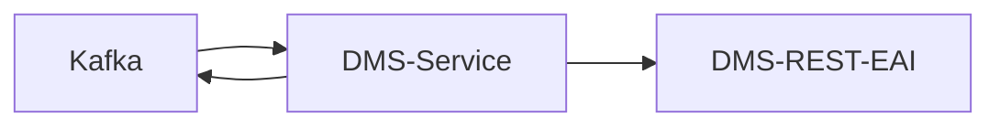

# SWIM DMS-Service

SWIM service for transferring files into DMS when notified by [dispatch-service](../dispatch-service) via Apache Kafka

## Architecture



For the DMS-REST-EAI the [`refarch-dms-integration-fabasoft-rest-api` module](https://github.com/it-at-m/refarch/tree/main/refarch-integrations/refarch-dms-integration/refarch-dms-integration-fabasoft-rest-api) is used. 

### Error handling

Errors which occur during processing a file are transmitted via Kafka to the [dispatch-service](../dispatch-service) which handles them accordingly.

### DMS

Further documentation regarding the DMS can be found here (internal only):
- https://confluence.muenchen.de/display/KM53/REST-EAI-Schnittstelle
- https://dmsresteai-dev-dmsresteai.apps.capk.muenchen.de/swagger-ui/index.html

## Development

- The dms-service is built with JDK21
- For local development and testing the dev docker-compose stack of the [dispatch-service](../dispatch-service) can be used.
    - Can be started with `docker compose up -d`
- The Spring profile `local` is preconfigured for using the stack
    - Activate it either manually or by using the provided run configuration
    - Additionally, the dms credentials need to be configured in the [`application-local.yml`](./src/main/resources/application-local.yml). See [Configuration](#configuration) for reference.
- After starting the application, file processing can be triggered via Kafka in one of the following ways:
    - via [dispatch-service](../dispatch-service)
    - via [Kafka-UI](http://localhost:8089/)

## Configuration

```yaml
# dms connection configuration
swim:
  dms:
    base-url:
    username:
    password:
  # use cases (Correct combinations are documented within domain.model.UseCase class)
  use-cases:
    - name: # required
      type: # <inbox|incoming_object> required
      coo-source: # <metadata_file|static|ou_default> required
      username:
      joboe:
      jobposition:
      target-coo: # required for coo-source static
```
