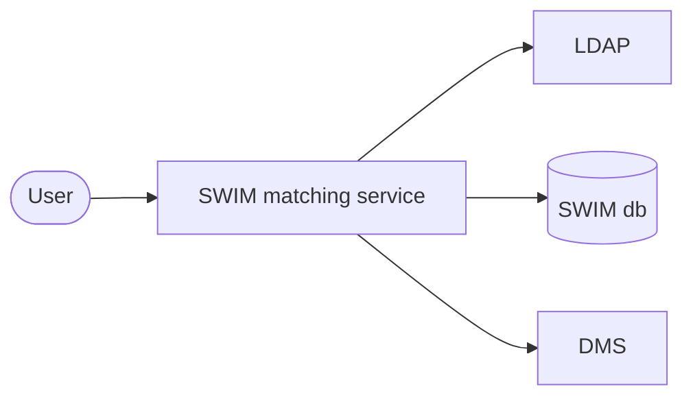

# SWIM matching service

Service for managing recipient matching data for the SWIM (stadtweites Inputmanagement).

## Data

Following data is collected and provided:
- DMS user inboxes which are enriched with the correlated user ldap data and put into the SWIM database
- DMS group inboxes which are directly put into the SWIM database

## Architecture



## Development

- The swim-matching-service is built with JDK21
- For local development and testing a dev docker-compose stack is provided in `./stack`
  - Can be started with `docker compose up -d`
- The Spring profile `local` is preconfigured for using the stack
  - Activate it either manually or by using the provided run configuration
- After starting the application, the import can be triggered via the [Swagger-UI](http://localhost:39146/swagger-ui/index.html)
  - The default login is `user` with password `user`
- Also following tools are available:
  - [pgAdmin](http://localhost:5050/)

## Configuration

```yaml
swim:
  schedule-cron: # cron for running automatic import from DMS
  ldap:
    search-ous: # list of ldap ous to resolve users from
    user-base-ou: # base ou format string to inject search-ous in for lookup; example: "ou=%s,c=de"
  dms-tenants: # list of tenants to be imported, others are ignored
  # dms connection configuration
  dms:
    base-url: 
    username: 
    password: 
    import-coo: # coo of the ContentObject which contains es the export as b64 encoded CSV
    import-username: # username used for loading import-coo
```
